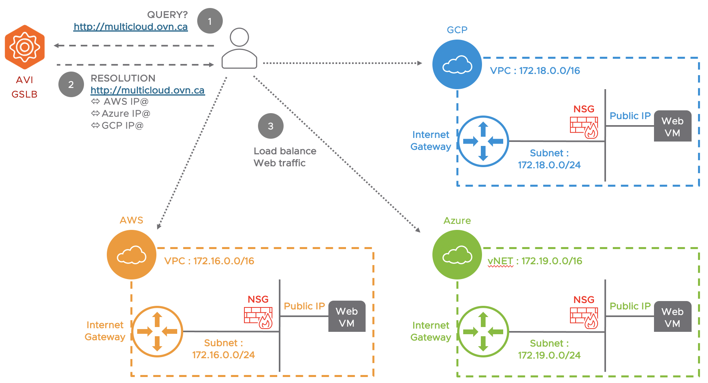

# Multi-Cloud Solution with AVI GSLB Services

This example is for DEMO purpose ONLY.

This repository provides terraform scripts to configure and demo the AVI Global Server Load Balancing (GSLB) for multicloud web applications.
The web application is based on Linux Ubuntu 18.04 and the latter is deployed on AWS, Azure and Google Cloud.

For each public cloud provider, terraform scripts will :
- Create a VPC or VNET with subnet 
- Create a Network Security Group and Firewall Rules
- Deploy a Virtual Instance based on Ubuntu 18.04
- Configure the Routing table
- Associate a public IP address to the Virtual Instance

The terraform scripts will also create and configure a GSLB service in the AVI controller in order to access to the multicloud web application.

NOTES: 
- Before to start, be sure that you understand the terraform files
- The AVI controller can be on-prem or SaaS

# Topology

# Requirements
	
1- Create a Service Account on AWS, Azure and GCP:

- For AWS: https://docs.aws.amazon.com/IAM/latest/UserGuide/id_roles_create_for-service.html
- For Azure: https://docs.microsoft.com/en-us/azure/active-directory/develop/howto-create-service-principal-portal
- For GCP: https://cloud.google.com/iam/docs/creating-managing-service-accounts
	
2- Create a "terraform.tfvars" to specify all required credentials (AWS, Azure, GCP and AVI). Here is an example:

	# AVI Credentials
	avi_username = "xxxxx"
	avi_password = "xxxxxx"

	# AWS Credentials
	aws_access_key="XXXXXXXXXXXXXXXXXXX"
	aws_secret_key="xxxxxxxxxxxxxxxxxxxxxxxxxxxxxx"
	aws_role_arn="arn:aws:iam::1212121212121212:role/xxxxxxxxxxxxxx"

	# Azure Credentials
	azure_application_id="xxxxxx-xxxxxx-xxxxxx-xxxxxxx"
	azure_auth_token="xxxxx-xxxxx-xxxxxx-xxxxxx"
	azure_tenant_id="xxxxxx-xxxxxxxx-xxxxxxx-xxxxxxx"
	azure_subscription_id="xxxxx-xxxx-xxxxxxx-xxxxxxx"

	# AVI Credentials
	avi_username="username"
	avi_password="password"
	
3- AVI controller requirements:

- To understand how GSLB works: https://avinetworks.com/docs/20.1/avi-gslb-overview/ 
- To configure a GSLB site: https://avinetworks.com/docs/20.1/avi-gslb-site-configuration-and-operations/ 
	
# Execution

To setup the demo, execute the "tfapply.sh" script.
All public IP addresses and the AWS instance's private key will be provided as shown below:

By default, the FQDN "http://multicloud.ovn.ca", handled by AVI GSLB, will be created to access to the multicloud web application.

# Destroy

Execute the "tfdestroy.sh" script in order to destroy the demo environment.

Enjoy ! 
